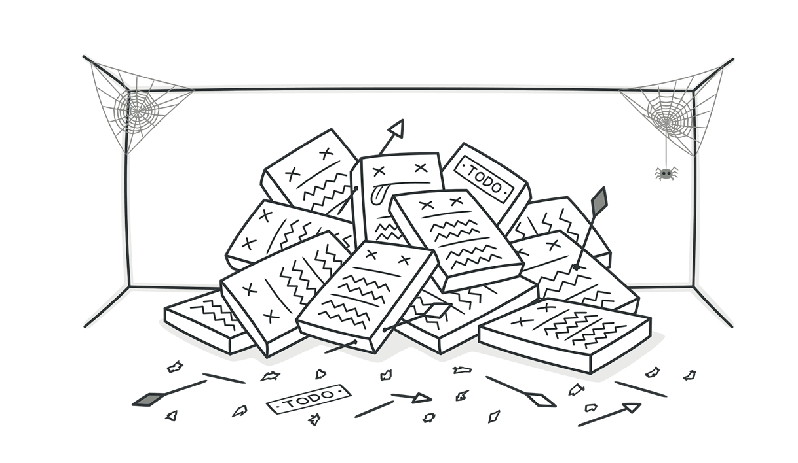

# 函数



函数是程序的基本逻辑处理单元，在我的职业生涯中，有幸维护过一个大约有5000行代码的函数，这个函数几乎包罗万象，应有应有，里面的逻辑更是错综复杂，相信只有真正经历过的人，才知道这是一件多么艰巨而痛苦的事情！

所以，写好一个函数，就两个规则：

***第一个规则是要短小，第二个规则是更加短小！***

我无法证明这个断言，也给不出任何证实了小函数更好的研究结果，但是经过漫长的试错，经验告诉我，函数就应该短小！

那么，函数到底该有多长？我们常说的函数不能超过一屏。当然，现在很多的大屏显示器，一屏可以显示100多行，***我觉得这太长了，20行应该是封顶了，15行以内应该最佳！***

那如何做到这么短小呢？请记住下面的原则：

***函数应该做一件事！做好这一件事情！只做这一件事情！***

我们先来看个例子，这个例子是我刚刚开始接触Java编程时练习过的代码：
```java
public void greetings(String timePhase) {
    if (timePhase.equals("morning")) {
        System.out.println("Good morning");
    } else if (timePhase.equals("afternoon")) {
        System.out.println("Good afternoon");
    } else if (timePhase.equals("evening")) {
        System.out.println("Good evening");
    } else {
        System.out.println("Good night");
    }
}
```

你觉得上面的代码如何？当我第一次运行它成功的时候，感觉自己棒极了！

但是慢慢的发现，里面有太多的`if...else`判断语句了，当我新增一种条件的时候，就必须添加一个新的判断语句！

当我后面学习到`switch`语句的时候，觉得这个简直太棒了，我可以将其改写如下：
```java
public void greetings(String timePhase) {
    TimePhase timePhaseEnum = TimePhase.valueOf(timePhase.toUpperCase());
    switch (timePhaseEnum) {
        case MORNING:
            System.out.println("Good morning");
            break;
        case AFTERNOON:
            System.out.println("Good afternoon");
            break;
        case EVENING:
            System.out.println("Good evening");
            break;
        case NIGHT:
        default:
            System.out.println("Good night");
    }
}
enum TimePhase {
    MORNING, AFTERNOON, EVENING, NIGHT;
}
```

上面的写法虽然比`if...else`好些，但是仍然没有解决根本问题：当我新增一种条件的时候，就必须添加一个新的判断语句！

为什么会这样呢？因为上面的代码做了两件事情：
1. 判断`timePhase`代表的时间段。
2. 打印相关的欢迎语。

那么我们将这两件事情分离开来如何？
```java
public class Demo {
    public static void greetings(String timePhase) {
        Arrays.stream(TimePhase.values())
                .map(val -> val.name().toLowerCase())
                .filter(val -> val.equals(timePhase))
                .findFirst().ifPresent(Demo::printGreeting);
    }

    private static void printGreeting(String timePhase) {
        System.out.println("Good " + timePhase);
    }
}

enum TimePhase {
    MORNING, AFTERNOON, EVENING, NIGHT;
}
```

## 单一职责原则（Single Responsibility Principle）


