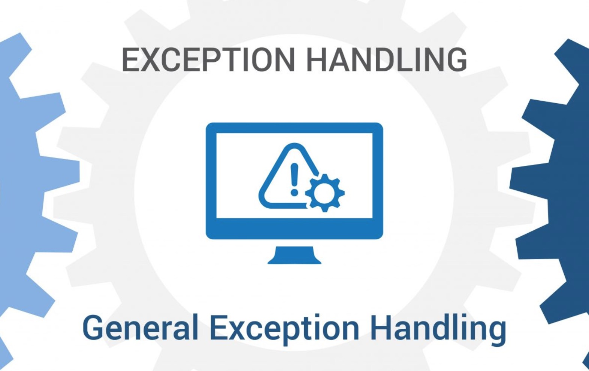

# 异常的处理



我有一个做后端开发的程序员的同学，主要工作是给前端应用提供一些服务。曾经有一段时间，他几乎是天天收到客户的电话，叫他过来解决问题，当他跑过去解决问题时，不是客户网线没有插好，就是客户的路由器断电了。。。他解决的次数多了，就感觉有些奇怪，于是要求Review前端的代码，于是他看到了类似于如下的代码块：
```javascript
try {
    http.get('xxxxx');
    // 这里省略其他一些请求
} catch (err) {
    alert("服务异常，请联系：XXX，电话：138xxxxxxxxx");
}
```
看到这样代码的当天，他就连夜提桶跑路了。。。

错误处理及其重要，好的错误处理不仅能增加系统的健壮性，还能让人预约，但是不恰当的错误处理，不仅搞乱了代码逻辑，而且会让人连夜提桶跑路！

## try...catch...finally

`try...catch...`语句块异常奇妙，它们在程序中***定义了一个范围。*** 在执行这个范围内的语句的时候，你是在表明随时可取消执行，并在catch语句中接续。

在某种意义上，`try...catch...`语句块就像是事务，catch代码块将程序维持在一种持续状态，无论try代码块中发生了什么均是如此。所以，在编写可能抛出异常的代码时，最好先写出`try-catch-finally`语句。这能帮你定义代码的用户应该期待什么，无论try代码块中执行的代码出什么错都一样！

下面我们将指定一些异常处理的规范，并做举例说明！

## 使用异常而非返回码

请看下面的这段代码：
```java
public void sendShutDown() {
    DeviceHandle handle = getHandle(DEV1);
    if (handle != DiviceHandle.INVALID) {
        Record record = retrieveDeviceRecord(handle);
        if (record.getStatus() != DEVICE_SUPPORT) {
            pauseDevice(handle);
            clearDeviceWorkQueue(handle);
            closeDevice(handle);
        } else {
            Logger.error("Device Suspended. Unable to shut down!")
        }
    } else {
        Logger.error("Invalid handle for :" + DEV1.toString());
    }
}
```

上面代码的主要问题在于它们搞乱了调用者代码。调用者必须在调用之后即可检查错误。不幸的是，这个步骤经常被忘记，所以，遇到错误的时候，最好抛出一个异常。这样，调用的代码将很整洁，其逻辑不会被错误处理搞乱。

例如，上面代码可以改写如下：
```java
public void sendShutDown() {
    try {
        tryToShutDown();
    } catch(DeviceShutDownError error) {
        Logger.error(error);
    }
}

private void tryToShutDown() throws DeviceShutDownError() {
    DeviceHandle handle = getHandle(DEV1);
    Record record = retrieveDeviceRecord(handle);
    pauseDevice(handle);
    clearDeviceWorkQueue(handle);
    closeDevice(handle);
}
```

## 多使用不可控异常

在Java中，一般异常有两种实现模型，一种是（Checked Exception）受控异常；另一种是（Runtime Exception）非受控异常。

* 受控异常：是指那些需要在客户显式捕获、处理或抛出的异常，它们继承自java.lang.Exception；
* 运行时异常：是指不需要客户显式捕获、处理或抛出的异常，它们继承自Java.lang.RuntimeException。

使用运行时异常可以有效避免“污染”用户，如果采用受控异常，在处理一些接口时就会抛出底层的远程通信异常，它会强迫客户捕获并处理，如果客户不处理继续往上层的调用端抛出，如所有的异常都往上抛，那么Web层的WebController就要去处理这些异常，达到了污染的目的。

受控异常的代价就是违反开放闭合原则，如果你在方法中抛出可控异常，而Catch语句在三个层级之上，你就得在catch语句和抛出异常处之间的每个方法签名中申明该异常。这就意味着对软件中较低层级的修改，都将设计到较高层级的签名被修改，重建和发布，即便是他们自身关注的任何东西都没有改动过！

所以，你在抛出某个异常时，都应当提供足够的环境说明，以便判断错误的来源和处所。应该创建信息充分的错误消息，并和异常一起传递出去。在消息中，包括失败的操作和失败的类型。如果你的应用程序有日志系统，传递足够的信息给catch块，并记录下来！

## 别返回null值，也别传递null值

如果说发生错误异常的情况，首当其冲的就是”NullPointerException“, 这个一个价值为十亿美元的错误! 我都不想去计算曾经见过多少几乎每行代码都在检查null值的应用程序。

类似于下面这样的例子：
```java
public void registerItem(Item item) {
    if (item != null) {
        ItemRegistry registry = peristentStore.getItemRegistry();
        if (registry != null) {
            Item existItem = registry.getItem(item.getID());
            if (existItem != null && existItem.getBillingPeriod().hasRetailOwner()) {
                existing.register(item);
            }
        }
    }
}
```

你觉得上面的代码如何？简直糟糕透了吧？！返回null值基本上是给自己增加工作量，也是在给调用者添堵！只要有一处没有检查null值，应用程序就会失控！

如何改进呢？

要么返回默认值，要么思考用更好的表达方式，要么思考为什么需要这个null作为返回值？返回null需要表达什么业务逻辑？如果业务上体现不出来null，为什么要将其返回出去？！！

当你以为在方法中返回null值是很糟糕的做法时，如果将null值进行参数传递，那就是惨绝人寰了！

你传递的这个null就必须要求改函数进行入参校验，这简直让人无法理解！比如上面的案例代码：
```java
registerItem(null);
```
这样的代码啥也做不了！既然啥都做不了，为啥要调用它？

除非API要求你向他传递null值，否则就要尽可能避免传递null值！或者，想想方法重载是怎么玩的，就理解了！